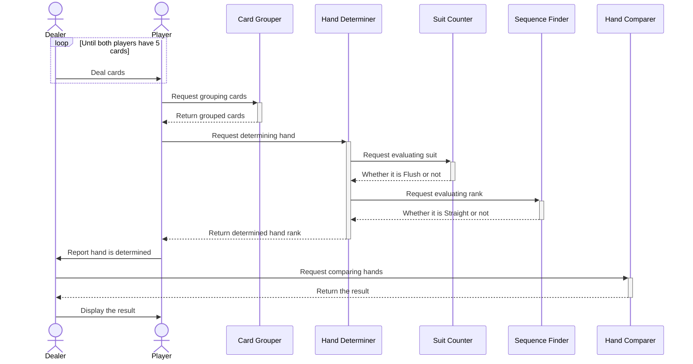

# Sequence Diagram

```mermaid
sequenceDiagram
    actor Dealer
    actor Player
    participant Grouper as Card Grouper
    participant Determiner as Hand Determiner
    participant Counter as Suit Counter
    participant SequenceFinder as Sequence Finder
    participant Comparer as Hand Comparer

    loop Until both players have 5 cards
        Dealer ->> Player: Deal cards
    end
    Player ->>+ Grouper: Request grouping cards
    Grouper -->>- Player: Return grouped cards
    Player ->>+ Determiner: Request determining hand
    Determiner ->>+ Counter: Request evaluating suit
    Counter -->>- Determiner: Whether it is Flush or not
    Determiner ->>+ SequenceFinder: Request evaluating rank
    SequenceFinder -->>- Determiner: Whether it is Straight or not
    Determiner -->>- Player: Return determined hand rank
    Player ->> Dealer: Report hand is determined
    Dealer ->>+ Comparer: Request comparing hands
    Comparer -->>- Dealer: Return the result
    Dealer ->> Player: Display the result
```
